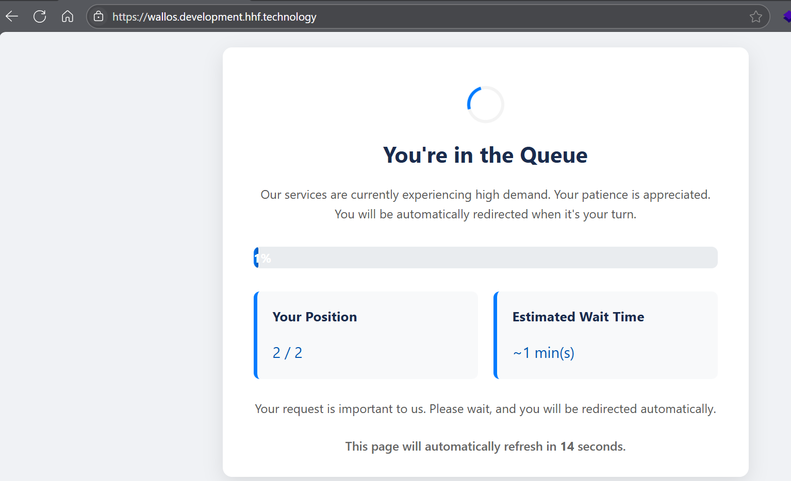

<div align="center" width="100%">
    <h1>Traefik Queue Manager Middleware Plugin for Traefik v3</h1>
    
    <a target="_blank" href="https://GitHub.com/hhftechnology/traefik-queue-manager/graphs/contributors/"></a><br>
    <a target="_blank" href="https://GitHub.com/hhftechnology/traefik-queue-manager/commits/"></a>
    <a target="_blank" href="https://GitHub.com/hhftechnology/traefik-queue-manager/issues/"></a>
    <a target="_blank" href="https://github.com/hhftechnology/traefik-queue-manager/issues?q=is%3Aissue+is%3Aclosed"></a><br>
        <a target="_blank" href="https://github.com/hhftechnology/traefik-queue-manager/stargazers"></a>
    <a target="_blank" href="https://github.com/hhftechnology/traefik-queue-manager/network/members"></a>
    <a target="_blank" href="https://github.com/hhftechnology/traefik-queue-manager/watchers"></a><br>
</div>

<div align="center" width="100%">
    <p>A Traefik middleware plugin that implements a queue management system for your services, helping to manage traffic spikes by limiting the number of concurrent users and providing a fair waiting experience.</p>
    <a target="_blank" href="https://github.com/hhftechnology/traefik-queue-manager"></a>
</div>

## 📝 Forums

[See the forums for further discussion here](https://forum.hhf.technology/)
Make Traefik a powerful static file server!



## How It Works

When traffic exceeds your configured capacity:
1. New visitors are placed in a queue
2. Users are shown their position in the queue with estimated wait time
3. The queue page automatically refreshes at configurable intervals
4. When capacity becomes available, visitors are let in based on first-come, first-served

The plugin uses a client identifier (cookie or IP+UserAgent hash) to track visitors and ensure a fair queuing system.

## Features

- Configurable maximum number of concurrent users
- Custom queue page template
- Adjustable expiration time for sessions
- Option to use cookies or IP+UserAgent hash for visitor tracking
- Real-time capacity monitoring
- Visual progress indication for waiting users

## Installation

### From Traefik Pilot (Recommended)

```yaml
# Static configuration
experimental:
  plugins:
    traefik-queue-manager:
      moduleName: "github.com/hhftechnology/traefik-queue-manager"
      version: "v1.0.0"
```

### Manual Installation

1. Clone the repository:
   ```
   git clone https://github.com/hhftechnology/traefik-queue-manager.git
   ```

2. Build and install the plugin:
   ```
   cd traefik-queue-manager
   go build -o traefik-queue-manager
   ```

3. Configure Traefik to use the local plugin:
   ```yaml
   # Static configuration
   experimental:
     localPlugins:
       traefik-queue-manager:
         moduleName: "github.com/hhftechnology/traefik-queue-manager"
   ```

## Configuration

### Plugin Configuration Options

| Option | Type | Default | Description |
|--------|------|---------|-------------|
| `enabled` | boolean | `true` | Enable/disable the queue manager |
| `queuePageFile` | string | `queue-page.html` | Path to the queue page HTML template |
| `sessionTime` | duration | `60` | Duration for which a visitor session is valid |
| `purgeTime` | duration | `300` | How often expired sessions are purged from cache |
| `maxEntries` | int | `100` | Maximum number of concurrent users allowed |
| `httpResponseCode` | int | `429` | HTTP response code for queue page |
| `httpContentType` | string | `text/html; charset=utf-8` | Content type of queue page |
| `useCookies` | boolean | `true` | Use cookies for tracking; if false, uses IP+UserAgent hash |
| `cookieName` | string | `queue-manager-id` | Name of the cookie used for tracking |
| `cookieMaxAge` | int | `3600` | Max age of the cookie in seconds |
| `refreshInterval` | int | `30` | Refresh interval in seconds |
| `debug` | boolean | `false` | Enable debug logging |

### Example Configuration

```yaml
# Dynamic configuration with Docker provider
labels:
  - traefik.http.middlewares.queuemanager.plugin.queuemanager.enabled=true
  - traefik.http.middlewares.queuemanager.plugin.queuemanager.queuePageFile=/path/to/queue-page.html
  - traefik.http.middlewares.queuemanager.plugin.queuemanager.maxEntries=500
  - traefik.http.middlewares.queuemanager.plugin.queuemanager.sessionTime=5m
  - traefik.http.middlewares.queuemanager.plugin.queuemanager.useCookies=true
  - traefik.http.middlewares.queuemanager.plugin.queuemanager.cookieName=queue-manager-id
```

## Customizing the Queue Page

You can customize the queue page by modifying the HTML template. The template supports the following variables:

- `[[.Position]]` - Current position in queue
- `[[.QueueSize]]` - Total queue size 
- `[[.EstimatedWaitTime]]` - Estimated wait time in minutes
- `[[.RefreshInterval]]` - Refresh interval in seconds
- `[[.ProgressPercentage]]` - Visual progress percentage
- `[[.Message]]` - Custom message

## Example Usage with Docker Compose

```yaml
services:
  traefik:
    image: traefik:v3.3.4
    container_name: traefik
    command:
      - --log.level=INFO
      - --api.insecure=true
      - --providers.docker=true
      - --entrypoints.web.address=:80
      - --experimental.localPlugins.queuemanager.moduleName=github.com/hhftechnology/traefik-queue-manager
    ports:
      - "80:80"
      - "8080:8080"
    volumes:
      - /var/run/docker.sock:/var/run/docker.sock
      - ./:/plugins-local/src/github.com/hhftechnology/traefik-queue-manager
    labels:
      - traefik.http.middlewares.queuemanager.plugin.queuemanager.enabled=true
      - traefik.http.middlewares.queuemanager.plugin.queuemanager.queuePageFile=/plugins-local/src/github.com/hhftechnology/traefik-queue-manager/queue-page.html
      - traefik.http.middlewares.queuemanager.plugin.queuemanager.maxEntries=5
      - traefik.http.middlewares.queuemanager.plugin.queuemanager.sessionTime=1m

  myservice:
    image: traefik/whoami
    container_name: myservice
    labels:
      - traefik.enable=true
      - traefik.http.routers.myservice.rule=Host(`service.local`)
      - traefik.http.routers.myservice.entrypoints=web
      - traefik.http.routers.myservice.middlewares=queuemanager
```
```yaml
# This is an example of how to configure the Queue Manager middleware
# in your Traefik dynamic configuration.
#
# If using Docker labels, you would prefix these with:
# "traefik.http.middlewares.my-queue-middleware.plugin.queuemanager."
#
# Example for a middleware named "my-queue-middleware":
#
# http:
#   middlewares:
#     my-queue-middleware:
#       plugin:
#         queuemanager:
#           # --- Basic Settings ---
#           enabled: true
#           # Description: Globally enables or disables the queue manager middleware.
#           # Default: true
#           # Tuning: Set to `false` to bypass queueing entirely without removing the middleware configuration.
#
#           maxEntries: 50
#           # Description: The maximum number of concurrent users allowed to access the target service
#           # before new users are placed into the queue.
#           # Default: 100 (from CreateConfig in Go code)
#           # Tuning: This is the most critical value. Set it based on your backend service's actual capacity
#           # to handle concurrent requests without performance degradation. Start conservatively and monitor.
#
#           # --- Session Timeouts ---
#           inactivityTimeoutSeconds: 300
#           # Description: Defines how long an *active* user's session remains valid if they are inactive
#           # (i.e., make no further requests to the service). After this period, their slot may be freed up.
#           # Default: 60 (from CreateConfig in Go code)
#           # Tuning:
#           #   - Too short: Users reading a page or briefly idle might get requeued.
#           #   - Too long: Idle users occupy slots longer, slowing queue progression.
#           #   - Consider average user interaction time. 5-10 minutes (300-600s) is often reasonable.
#
#           hardSessionLimitSeconds: 3600
#           # Description: (Optional) An absolute maximum duration (in seconds) for any active session,
#           # regardless of user activity. If set to 0, this feature is disabled.
#           # Default: 0 (disabled, from CreateConfig in Go code)
#           # Tuning: Use this to ensure fair access over very long periods or to prevent indefinitely held slots.
#           # For example, 3600 (1 hour) ensures a slot is freed at least hourly.
#
#           # --- Queue Mechanics ---
#           cleanupIntervalSeconds: 60
#           # Description: How frequently the plugin's internal cleanup process runs. This process evicts
#           # expired (inactive or hard-limited) sessions and promotes users from the queue.
#           # Default: 30 (from CreateConfig in Go code, previously 300 in older versions)
#           # Tuning: Should be responsive. A good value is often `inactivityTimeoutSeconds / 2` or at least
#           # no more than `inactivityTimeoutSeconds`. A value like 30-60 seconds ensures timely promotions.
#
#           queueStrategy: "fifo"
#           # Description: The strategy for processing the queue. Currently, only "fifo" (First-In, First-Out)
#           # is implemented and supported.
#           # Default: "fifo" (from CreateConfig in Go code)
#           # Tuning: Stick with "fifo" for fairness.
#
#           # --- Queue Page Customization ---
#           queuePageFile: "/etc/traefik/queue-templates/my-custom-queue-page.html"
#           # Description: Absolute path to your custom HTML template file for the queue page.
#           # The plugin needs read access to this file from where Traefik is running (e.g., inside the Traefik container).
#           # If not provided or the file is not found, a built-in default template is used.
#           # Default: "queue-page.html" (relative path, from CreateConfig in Go code, ensure it's accessible)
#           # Tuning: Customize this page for branding and user experience. Ensure it uses the placeholders
#           # like `[[.RefreshInterval]]`, `[[.Position]]`, `[[.QueueSize]]`, etc.
#
#           refreshIntervalSeconds: 20
#           # Description: How often the queue page (served to waiting users) automatically refreshes
#           # to update their position and estimated wait time. This value is passed to the `[[.RefreshInterval]]`
#           # placeholder in your `queuePageFile`.
#           # Default: 20 (from CreateConfig in Go code, previously 30 in older versions)
#           # Tuning: 15-30 seconds is a good range. Too short can be distracting; too long makes users feel uninformed.
#
#           minWaitTimeMinutes: 1
#           # Description: The minimum estimated wait time (in minutes) that will be displayed to users,
#           # even if the calculated wait time is less (but not zero). Prevents showing "0 minutes" if they are still queued.
#           # Default: 1 (from CreateConfig in Go code)
#           # Tuning: 1-2 minutes is usually a good minimum to manage expectations.
#
#           httpResponseCode: 429
#           # Description: The HTTP status code returned when serving the queue page.
#           # `429 Too Many Requests` is semantically appropriate.
#           # Default: 429 (from CreateConfig in Go code)
#           # Tuning: Usually no need to change. `503 Service Unavailable` is an alternative.
#
#           httpContentType: "text/html; charset=utf-8"
#           # Description: The Content-Type header for the queue page.
#           # Default: "text/html; charset=utf-8" (from CreateConfig in Go code)
#           # Tuning: Keep as is for standard HTML pages.
#
#           # --- Client Identification (Cookies) ---
#           useCookies: true
#           # Description: Whether to use cookies (`true`) or an IP Address + User-Agent hash (`false`)
#           # to identify and track users.
#           # Default: true (from CreateConfig in Go code)
#           # Tuning: `true` (cookies) is generally recommended for better accuracy and fairness, especially
#           # if users might share IPs or have dynamic IPs.
#
#           cookieName: "my_app_queue_id"
#           # Description: The name of the cookie used for tracking if `useCookies` is `true`.
#           # Default: "queue-manager-id" (from CreateConfig in Go code)
#           # Tuning: Change if the default name conflicts with other cookies used by your applications.
#
#           cookieMaxAgeSeconds: 7200
#           # Description: The maximum age of the tracking cookie in the user's browser (in seconds).
#           # This determines how long a user might be remembered if they close and reopen their browser.
#           # It's different from server-side session timeouts.
#           # Default: 3600 (1 hour, from CreateConfig in Go code)
#           # Tuning: 1-2 hours (3600-7200s) is common. Longer might be convenient for users in very long queues.
#
#           # --- Logging & Debugging ---
#           debug: false
#           # Description: Enables verbose debug logging for the plugin. This will override `logLevel` to "debug".
#           # Default: false (from CreateConfig in Go code)
#           # Tuning: Set to `true` ONLY for troubleshooting. Disable in production as it's very verbose.
#
#           logLevel: "info"
#           # Description: Sets the logging level for the plugin. Options: "debug", "info", "warn", "error".
#           # If `debug` is `true`, this is effectively "debug".
#           # Default: "info" (from CreateConfig in Go code)
#           # Tuning: "info" is good for production. "warn" or "error" for less verbosity if "info" is too much.
#
#           logFile: ""
#           # Description: (Optional) Path to a file where plugin logs should be written.
#           # If empty or not specified, logs go to Traefik's standard output (stderr).
#           # Ensure Traefik has write permissions to this path if specified.
#           # Default: "" (stderr, from CreateConfig in Go code)
#           # Tuning: Use if you want to separate queue manager logs from main Traefik logs.
#
# Example of applying this middleware to a router (e.g., in Docker labels):
# labels:
#   - "traefik.http.routers.my-service.middlewares=my-queue-middleware@file" # If defined in a file provider
#   # or if defining the middleware directly on the router:
#   - "traefik.http.routers.my-service.middlewares=my-queue"
#   - "traefik.http.middlewares.my-queue.plugin.queuemanager.maxEntries=50"
#   - "traefik.http.middlewares.my-queue.plugin.queuemanager.inactivityTimeoutSeconds=300"
#   # ... and so on for other parameters ...
```

The plugin uses an in-memory cache to track active sessions, which provides excellent performance but means:

1. If you're running multiple Traefik instances, each will maintain its own separate queue
2. If Traefik restarts, all queue data is lost

For high-availability setups, consider using a shared Redis cache or similar solution.

## Contributing

Contributions are welcome! Please feel free to submit a Pull Request.

## License

This project is licensed under the MIT License - see the LICENSE file for details.
